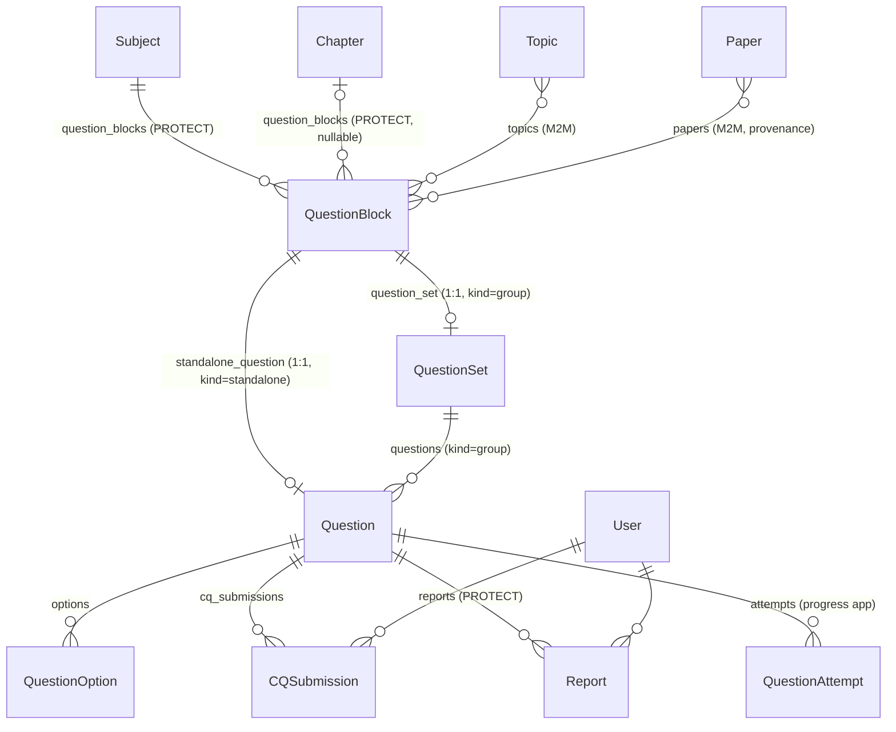

# Questions App — Design & API Guide

A reference for the `shomadhan.questions` Django app: how the data model is designed,
how the API serves it, and what should be improved. It is written so the design can
be moved into another Django + DRF project.

Source files: `shomadhan/questions/{models,schemas,validators,serializers,filters,views,urls,admin}.py`.
Snapshot taken from branch `feat/new-schema` (2026-09-16).

---

## 1. What the app does

It stores exam questions of many types (MCQ, creative question, fill-in-the-blank,
ordering, …) that belong to a subject/chapter. It serves them as a paginated,
filterable feed, and records a few user actions on them: favorite, report,
CQ answer submission, and bulk practice-session answers.

Main ideas:

1. **One table to paginate** (`QuestionBlock`), even though a chapter mixes single
   questions with groups of questions that share a stimulus.
2. **One `Question` table for every type.** Type-specific data goes in a JSON
   `metadata` column, which a Pydantic schema per type validates.
3. **Rich content is stored as HTML + LaTeX strings** and rendered by the client.
4. **The user's profile scopes the content** (education level + academic group).
   It never comes from query params.

---

## 2. Data model



### 2.1 The two block shapes

```
kind = "standalone"                     kind = "group"
───────────────────                     ──────────────
QuestionBlock                           QuestionBlock
 └─ Question        (block FK set)       └─ QuestionSet   (stimulus / উদ্দীপক)
     └─ QuestionOption × N                   ├─ Question a  (question_set FK set)
                                             │   └─ QuestionOption × N
                                             ├─ Question b
                                             └─ Question c …
```

**Why blocks exist:** a chapter feed has to order and paginate "one question" and
"one stimulus with 4 questions" as equal items. Without a shared parent you would need
a `UNION` of two tables with ordering and offset pagination across both. The block
table holds the **scoping** (subject, chapter, topics, papers) and the **ordering**
(`order_in_chapter`) once. Questions hold only their content.

### 2.2 Models

#### `QuestionBlock` (extends `TimeStampedModel`)
| Field | Type | Notes |
|---|---|---|
| `subject` | FK → `curriculum.Subject`, PROTECT | required scope |
| `chapter` | FK → `curriculum.Chapter`, PROTECT, nullable | some content is subject-level |
| `topics` | M2M → `curriculum.Topic` | optional finer tagging |
| `papers` | M2M → `archive.Paper` | provenance (board / college / university / unit / year) |
| `kind` | `standalone` \| `group` | selects which branch is populated |
| `order_in_chapter` | PositiveSmallInteger | feed order |
| `question_count` | PositiveSmallInteger | **denormalized**, 1 for standalone, N for group |
| `slug` | unicode slug, unique | auto `b-{pk}` |

Indexes: `(subject, chapter)`, `(chapter, order_in_chapter)`, `(kind)`.

#### `QuestionSet` (extends `TimeStampedModel`)
The shared stimulus of a group block. It has **no scoping fields of its own**; they
come from the block.

| Field | Type | Notes |
|---|---|---|
| `block` | OneToOne → `QuestionBlock`, CASCADE | reverse: `block.question_set` |
| `stimulus_type` | `text/image/table/diagram/code/composite`, blank | rendering hint only |
| `stimulus_content` | Text (HTML+LaTeX) | |
| `slug` | unique, auto `qs-{pk}` | |

Index: trigram GIN on `stimulus_content`.

#### `Question` (extends `TimeStampedModel`)
| Field | Type | Notes |
|---|---|---|
| `block` | OneToOne → `QuestionBlock`, nullable | set **only** for standalone |
| `question_set` | FK → `QuestionSet`, nullable | set **only** for grouped |
| `question_type` | `mcq, cq, fib, ordering, short_answer, long_answer, flow_chart, transformation` | |
| `label` | Char(8) | e.g. `a`, `b`, `(i)` |
| `marks` | Decimal(4,2), default 1 | DRF serializes it as a string (`"1.00"`) |
| `order_in_set` | PositiveSmallInteger | used only in groups |
| `prompt_content` | Text (HTML+LaTeX) | required |
| `model_answer` | Text | used by CQ / written types |
| `explanation` | Text | |
| `metadata` | JSON | shape depends on `question_type` (§2.3) |
| `slug` | unique, auto `q-{pk}` | |

Constraints:
- `questions_question_block_xor_set`: `CheckConstraint` requiring **exactly one** of
  `block` / `question_set`. The database enforces the ownership rule.

Indexes: `(question_set, order_in_set)`, `(question_type)`, trigram GIN on `prompt_content`.

`AUTO_GRADED_TYPES = {mcq, fib, ordering}`. Every other type is graded manually
(`is_correct = NULL`).

#### `QuestionOption` (extends `TimeStampedModel`)
One model covers MCQ choices, FIB word-box items and ordering items.

| Field | Type | Notes |
|---|---|---|
| `question` | FK, CASCADE | `question.options` |
| `label` | Char(8) | `ক`, `A`, … |
| `content` | Text (HTML+LaTeX) | |
| `is_correct` | nullable bool | `NULL` = not applicable (e.g. ordering items) |
| `position` | PositiveSmallInteger | unique per question. **For `ordering`, position is the correct order** |

`Meta.ordering = ["question_id", "position"]`.

#### `CQSubmission` (plain `models.Model`, append-only)
| Field | Notes |
|---|---|
| `user`, `question` | FK, CASCADE |
| `parts` | JSON: `[{"label": "a", "text": "..."}, …]` |
| `submitted_at` | auto_now_add |

Index `(user, question, -submitted_at)`. The latest row is the current answer.

#### `Report` (extends `TimeStampedModel`)
| Field | Notes |
|---|---|
| `user` | FK, CASCADE |
| `question` | FK, **PROTECT**: a reported question cannot be deleted by accident |
| `reason` | `question / answer / explanation / illogical` |
| `description` | free text, optional |
| `status` | `open / reviewed / dismissed` |

Indexes `(question, status)`, `(status, created_at)`, `(user, -created_at)`.

#### Related: `progress.QuestionAttempt`
It is not in this app, but the views write to it. It is an append-only log per user and
question, with `is_correct` (nullable), `selected_option_ids`, `source`
(`mock / practice_test / practice_session / daily_challenge / cq_submission`),
`source_ref` and `attempted_at`. The mistake book, analytics and streaks read from it.

### 2.3 Per-type `metadata` (Pydantic, `schemas.py`)

Every schema uses `extra="forbid"`, so unknown keys are rejected.
`validators.validate_question_metadata(question)` looks up
`METADATA_SCHEMA[question_type]` and turns Pydantic errors into a Django
`ValidationError({"metadata": …})`. It runs from `Question.clean()`.

| Type | Schema | Shape |
|---|---|---|
| `mcq` | `McqMetadata` | `{"select_mode": "single" \| "multiple"}` |
| `cq` | `CqMetadata` | `{}` |
| `fib` | `FibMetadata` | `{"fib_subtype": str, "blanks": [{"id": str, "correct_option_ref": str?, "answer_text": str?}]}` |
| `ordering` | `OrderingMetadata` | `{}` (the order is in `QuestionOption.position`) |
| `short_answer` | `ShortAnswerMetadata` | `{}` |
| `long_answer` | `LongAnswerMetadata` | `{"writing_task": str?, "graph_image_url": str?}` |
| `flow_chart` | `FlowChartMetadata` | `{"nodes": [{"id", "text", "prefilled": bool, "connects_to": [id]}]}` |
| `transformation` | `TransformationMetadata` | `{"transformation_subtype": str}` |

**Pattern to reuse:** one polymorphic table + a JSON column + a registry
`{type: PydanticModel}`. You avoid a table (or multi-table inheritance) per type, and
the JSON is still validated.

### 2.4 Content format

`prompt_content`, `model_answer`, `explanation`, `stimulus_content` and
`QuestionOption.content` hold **HTML + LaTeX** (`$…$`, `$$…$$`). They are sanitized
**once at import** with `bleach` (allowed tags: `b i u sup sub br ul ol li p`) and are
never escaped or stripped in views or serializers. The mobile client renders them with
`flutter_widget_from_html` + `flutter_math_fork`.

### 2.5 Slugs

`Block`, `Set` and `Question` all use the same `save()` pattern:

```python
def save(self, *args, **kwargs):
    creating = self._state.adding
    super().save(*args, **kwargs)
    if creating and not self.slug:
        self.slug = f"q-{self.pk}"
        super().save(update_fields=["slug"])
```

`bulk_create` skips `save()`, so import scripts either set explicit slugs or run a
backfill afterwards (`scripts/backfill_slugs.py`, migration `0005_backfill_pk_slugs`).

### 2.6 Denormalized counts

`QuestionBlock.question_count` → `Chapter.{block_count, question_count}` →
`Subject` → `AcademicGroup` → `EducationLevel`. **No signal updates these.**
`scripts/backfill_counts.py` recomputes them from the bottom up after each import.

### 2.7 Search indexes

Migration `0007` enables `pg_trgm` and builds trigram GIN indexes with
`CREATE INDEX CONCURRENTLY` (`atomic = False`, inside `SeparateDatabaseAndState` so the
model state still knows about the indexes). With these indexes, `icontains` search on
Bengali text works without a full-text dictionary.

---

## 3. API

All paths are under `/api/v1/`. Auth is JWT only (`JWTAuthentication`). The global
default permission is `IsAuthenticated`. Pagination is `LimitOffsetPagination`
(`?limit=` default 20, max 100; `?offset=`).

| Method | Path | View | Auth | Purpose |
|---|---|---|---|---|
| GET | `/questions/blocks/` | `QuestionBlockViewSet` (list only) | AllowAny | Paginated feed of blocks with the full nested tree |
| GET | `/mcqs/?flagged=true` | `FlaggedMcqListView` | required | Blocks containing questions the user has **reported** |
| POST / DELETE | `/questions/{pk}/favorite/` | `FavoriteView` | required | Add / remove favorite |
| POST | `/questions/{pk}/report/` | `ReportView` | required | File a report |
| POST | `/questions/{pk}/cq-submit/` | `CQSubmitView` | required | Save CQ answers, returns the model answer |
| POST | `/questions/practice-sessions/` | `PracticeSessionView` | required | Bulk-record practice answers |

`FlaggedMcqListView` is registered in `config/api_router.py` (the mobile client expects
that path). The rest come from `shomadhan/questions/urls.py`.

### 3.1 `GET /questions/blocks/`

**Scoping:** if the user is authenticated *and* onboarded, blocks are filtered to
`subject.education_level = user.education_level` and
`subject.academic_group ∈ {user.academic_group, "general"}`. Anonymous and
not-yet-onboarded users get unscoped results.

**Query params** (`QuestionBlockFilter`):

| Param | Semantics |
|---|---|
| `subject` | subject id (int) |
| `chapter` | chapter id (int) |
| `topics` | repeatable, `?topics=1&topics=2` → OR |
| `kind` | `standalone` \| `group` |
| `question_type` | blocks with ≥1 question of that type, through **either** path (`Exists(standalone) OR Exists(grouped)`) |
| `q` | substring search on `Question.prompt_content` (min 2 chars, otherwise empty result). Stimulus text is intentionally left out for performance |
| `board`, `college`, `university`, `unit` | repeatable ids on the linked `Paper`. Different params are **OR**'d together |
| `year` | `Paper.year`, **AND**'d with the institution clause |
| `ordering` | `order_in_chapter`, `question_count` (± prefix) |

Provenance detail: all `papers__…` conditions are built into **one `Q`** and applied in
**one `.filter()`**, so they must match the **same Paper row**. Separate `.filter()`
calls on an M2M create separate JOINs and can match conditions across different papers.
The provenance filters are declared as no-op methods (so they appear in the schema) and
applied in `filter_queryset()`. `.distinct()` is always applied at the end.

Default order: `chapter__chapter_number, order_in_chapter, pk`.

Queries: `select_related("subject", "chapter")` plus
`prefetch_related("topics", "standalone_question__options", "question_set__questions__options")`.
The number of queries is fixed regardless of page size.

**Response item:**
```json
{
  "id": 42,
  "slug": "b-42",
  "kind": "group",
  "order_in_chapter": 3,
  "question_count": 4,
  "subject": {"id": 1, "slug": "পদার্থবিজ্ঞান", "name": "পদার্থবিজ্ঞান"},
  "chapter": {"id": 7, "slug": "গতি", "name": "গতি", "chapter_number": 2},
  "topics": [{"id": 11, "slug": "…", "name": "…"}],
  "question_set": {
    "id": 9, "slug": "qs-9", "stimulus_type": "text",
    "stimulus_content": "<p>…$v = u + at$…</p>",
    "questions": [
      {
        "id": 100, "slug": "q-100", "question_type": "cq", "label": "a",
        "marks": "1.00", "order_in_set": 0,
        "prompt_content": "…", "model_answer": "…", "explanation": "…",
        "metadata": {}, "options": []
      }
    ]
  },
  "standalone_question": null
}
```
For `kind="standalone"`, `question_set` is `null` and `standalone_question` holds one
`Question` object with `options: [{id, label, content, is_correct, position}]`.

### 3.2 `POST|DELETE /questions/{pk}/favorite/`
- Requires an onboarded profile. Otherwise returns `400 application/problem+json`
  (`type: …/errors/not-onboarded`).
- Calls `progress.services.set_favorite(...)`. The favorite IDs are stored in
  `ExamProfile.favorite_question_ids` for that (user, level, group), updated under
  `select_for_update`. The call is idempotent.
- Response `200 {"is_favorite": true|false}`.

### 3.3 `POST /questions/{pk}/report/`
Body `{"reason": "question|answer|explanation|illogical", "description": "optional"}` →
`201 {"detail": "Report submitted."}`. Users list their own reports at
`GET /users/me/reports/` (`ReportListSerializer`).

### 3.4 `POST /questions/{pk}/cq-submit/`
- The question lookup is profile-scoped across both ownership paths.
  Non-CQ questions → `400 problem+json` (`…/errors/not-a-cq`).
- Body `{"parts": [{"label": "a", "text": "…"}, …]}` (min 1 part).
- Inside one transaction it writes a `CQSubmission` and a `QuestionAttempt`
  (`is_correct=null`, `source=cq_submission`, `source_ref=submission.pk`).
- `201 {"submission_id", "submitted_at", "model_answer"}`. The model answer is shown
  **after** the student submits.

### 3.5 `POST /questions/practice-sessions/`
```json
{
  "subject_id": 1,
  "chapter_ids": [7, 8],
  "duration_seconds": 600,
  "answers": [
    {"question_id": 100, "payload": {"selected_option_ids": [501]}}
  ]
}
```
- Loads the questions, profile-scoped, with their options prefetched. Unknown or
  out-of-scope IDs are silently skipped.
- **Retry protection:** it skips any question that already has a `practice_session`
  attempt within `now - (duration_seconds + 300s)`.
- Grading: for `AUTO_GRADED_TYPES` it compares `set(selected_option_ids)` with the set
  of options where `is_correct=True`. Other types get `is_correct = null`.
- Writes with `bulk_create`. That skips `post_save`, so the view calls `bump_streak`
  once itself.
- Returns `204`.

### 3.6 Answer payload contract (shared with `exams/services._check_answer`)
| Type | Payload |
|---|---|
| `mcq` | `{"selected_option_ids": [int]}` |
| `fib` | `{"blanks": [{"id": str, "answer": str}]}` (case-insensitive and trimmed, compared with `metadata.blanks[].answer_text`) |
| `ordering` | `{"ordered_option_ids": [int]}` (must equal the options sorted by `position`) |
| others | graded manually |

### 3.7 Error shape
The app's own errors follow RFC 7807 (`type`, `title`, `status`, `detail`,
`Content-Type: application/problem+json`). Validation errors use DRF's default shape.

---

## 4. Admin

- `QuestionBlockAdmin`: `filter_horizontal` for topics/papers, and an inline for the
  `QuestionSet`.
- `QuestionSetAdmin`: inline `Question`s (`fk_name="question_set"`).
- `QuestionAdmin`: inline `QuestionOption`s, `raw_id_fields` for owners.
- `ReportAdmin`: filter by status/reason.
- `CQSubmissionAdmin`: fully read-only.

---

## 5. Ingestion pipeline (context)

`scripts/import_*.py` read scraped JSON, sanitize HTML with `bleach`, and
`bulk_create` blocks → sets → questions → options with explicit slugs. After each
import, run:

```bash
python scripts/backfill_slugs.py     # any rows created without a slug
python scripts/backfill_counts.py    # denormalized counts, bottom-up
```

---

## 6. Porting checklist (moving this into another project)

1. Copy `models.py`, `schemas.py`, `validators.py`. Update the FK strings
   (`curriculum.Subject`, `curriculum.Chapter`, `curriculum.Topic`, `archive.Paper`) to
   your own taxonomy, or drop `papers` if you don't track provenance.
2. Keep the **block-xor-set `CheckConstraint`** and the OneToOne on `QuestionSet.block`.
   The design depends on them.
3. PostgreSQL is required for `GinIndex`/`OpClass`/`TrigramExtension`. On other
   databases, remove those indexes and the `q` filter falls back to a sequential scan.
4. Dependencies: `djangorestframework`, `django-filter`, `pydantic>=2`, `bleach`
   (import side), `drf-spectacular` (optional).
5. Replace the inline profile scoping with your own tenant/audience rule (see
   improvement A6).
6. Bring over, or replace, the `progress` pieces the views use: `QuestionAttempt`,
   `set_favorite`, `bump_streak`.
7. Plan how counts are maintained from day one (improvement B1). Don't copy the
   "backfill script only" approach unless your content is import-only.
8. Before copying, fix the Section A bugs below.

---

## 7. Improvements

Ordered by priority. **A = bugs / security**, **B = data integrity**,
**C = API design**, **D = performance**, **E = code structure**, **F = product / ops**.

### A. Bugs and security (fix first)

| # | Issue | Where | Fix |
|---|---|---|---|
| A1 | **`transaction` is never imported**, so every CQ submit raises `NameError` → 500 | `views.py:174` | `from django.db import transaction`. Add a test |
| A2 | **Grouped questions come back in random order.** `question_set.questions` is prefetched without `order_by` and `Question` has no `Meta.ordering`, so `order_in_set` is ignored | `views.py:53`, `:234` | `Prefetch("question_set__questions", queryset=Question.objects.order_by("order_in_set", "pk").prefetch_related("options"))`. Same for `topics` |
| A3 | **Answers leak in the public feed.** The list is `AllowAny` and returns `is_correct`, `model_answer`, `explanation`, and for `ordering` the options already in correct `position` order. Anyone can read every answer key, including answers to exam questions | `serializers.py`, `QuestionBlockViewSet` | Separate "question" and "answer" serializers. Hide answers until an attempt exists or behind a flag. Shuffle ordering items and expose a display order that differs from the correct order |
| A4 | **Practice-session grading is wrong for `fib` and `ordering`.** It uses set equality on `selected_option_ids`, while `exams/services._check_answer` uses blanks text and ordered IDs. The same answer gets a different result in practice and in an exam | `views.py:303-305` | Move `_check_answer` into a shared `questions/grading.py` and call it from both places |
| A5 | An MCQ with **no correct option marked** (`is_correct` all null/false) counts an empty answer as correct (`set() == set()`) | same | Treat "no correct options" as ungradable (`None`), and flag it on import |
| A6 | **Scoping is skipped for anonymous or non-onboarded users.** They see content from every level and group. There is also no paywall (`is_premium`, `is_locked`) at all, even though CLAUDE.md describes one | `views.py:57-64` | Decide the rule explicitly (require onboarding, or have a public subset). Add the paywall |
| A7 | `FavoriteView`, `ReportView` and `FlaggedMcqListView` **don't scope the question** to the profile, so any ID works | `views.py:103,121,213` | Use a shared scoped queryset (E2) |
| A8 | `practice-sessions` payload is `DictField(child=JSONField)`. `selected_option_ids` containing non-hashable values (`[{}]`) makes `set()` raise `TypeError` → 500. Option IDs are also never checked to belong to the question | `serializers.py:157-159` | Typed payload serializers per type. Intersect IDs with the question's options |
| A9 | The retry window depends on the **client-supplied `duration_seconds`**. A large value blocks legitimate re-answers, and a real second session inside the window is silently dropped | `views.py:279` | Use a client-generated `session_id` / `Idempotency-Key` and a unique constraint on `(user, question, source, source_ref)` |
| A10 | `ReportView` has **no throttle and no dedupe**, so it can be spammed | `views.py:114` | `throttle_scope = "report"`. Add a partial unique constraint on `(user, question, reason)` where `status='open'` |
| A11 | CQ `parts` have no length limit and labels aren't checked against the question | `serializers.py:169-175` | `max_length` on text, validate labels, cap the number of parts |
| A12 | Import sanitizer allows no `` and strips all attributes, but the model comments say content "embeds images via ``". One of the two is wrong | `scripts/import_data.py:49-58` vs `models.py` | Pick one contract. If images are allowed, whitelist `img[src]` with an allowed-host check |

### B. Data integrity

| # | Issue | Fix |
|---|---|---|
| B1 | `question_count` (and the chapter/subject counts) only change when the backfill script runs, so admin edits leave them stale. CLAUDE.md mentions a `questions/signals.py` that doesn't exist | `post_save`/`post_delete` handlers with `transaction.on_commit` + `dispatch_uid`, or compute counts at read time with `Count` + caching |
| B2 | `kind` isn't tied to the actual content: a `standalone` block could get a `QuestionSet`, a `group` block a standalone question | Validate in a creation service / `clean()`. Optionally a deferred constraint trigger |
| B3 | Nothing checks `block.chapter.subject == block.subject` | `clean()` + service check |
| B4 | `metadata` is only validated in `clean()`, which `save()`, `bulk_create` and imports never call | Validate in a `QuestionService.create()` used by imports and admin. Also add a management command to audit existing rows |
| B5 | Rules across fields aren't enforced: `select_mode="single"` with 2 correct options; `fib.blanks[].correct_option_ref` pointing to nothing; flow-chart `connects_to` pointing to unknown node IDs | Pydantic `model_validator` + service-level checks that know about the options |
| B6 | `ordering` uses `position` for both display order and correct order | Add `correct_position` (or `metadata.correct_order`) and let `position` be the display order |
| B7 | Slug assignment takes 2 writes per row, and `bulk_create` skips it | Derive `q-{pk}` in the serializer (no stored column), or pre-allocate IDs with `nextval()` in bulk imports |
| B8 | No content versioning. Editing a question changes the meaning of past attempts | `django-simple-history`, or a `revision` int stored on `QuestionAttempt` |
| B9 | `Report.question` is `PROTECT`, so a question with any report can never be deleted, even a dismissed one | Keep PROTECT on purpose but document it, or cascade once reports are closed |
| B10 | `QuestionBlock.chapter` is nullable, so ordering by `chapter__chapter_number` puts NULLs in a database-dependent position | `F("chapter__chapter_number").asc(nulls_last=True)` |

### C. API design

| # | Issue | Fix |
|---|---|---|
| C1 | **The code doesn't match CLAUDE.md.** URLs use `<int:pk>`, filters take int IDs and responses expose `id`, while the convention says slugs only. `user_state`, `/answer`, `/flag`, `ProfileFilteredViewSetMixin` and `QuestionPaywallMixin` are all documented but not implemented (`shomadhan/core/mixins.py` doesn't exist) | Implement them or update the docs. Choose one ID strategy |
| C2 | There is no detail endpoint (`GET /questions/{slug}/`, `GET /questions/blocks/{slug}/`), so deep links, sharing and SEO aren't possible | Add `RetrieveModelMixin` with `lookup_field="slug"` |
| C3 | List and detail would use the same heavy serializer: every list item carries the full explanation and model answer | A list serializer without answers, and a detail/answer serializer with them |
| C4 | There is no per-question `user_state` (favorite, attempted, last result), so the client needs extra calls | Annotate with `Exists` / subqueries on `QuestionAttempt` + favorites |
| C5 | `/mcqs/?flagged=true` means "reported", lives outside `/questions/`, returns all types (not only MCQs), and returns an empty list without the flag | Rename to `/questions/blocks/?reported=true` (a filter on the main viewset). Keep the old path as an alias |
| C6 | Error responses are hand-built dicts, and `Content-Type` is forced through `headers=` while DRF still renders JSON | Custom `APIException` subclasses + `drf-standardized-errors`. Use `422` for "not onboarded" / "not a CQ" (business rule) as the conventions say |
| C7 | `question_type != "cq"` is a magic string | `QuestionType.CQ` |
| C8 | `marks` goes out as a string (`"1.00"`) | `COERCE_DECIMAL_TO_STRING=False` or `FloatField` in the serializer. Document it either way |
| C9 | A `q` shorter than 2 characters silently returns nothing | Return `400` with a clear message |
| C10 | No OpenAPI annotations (`@extend_schema`) on the `APIView`s, so the generated schema is incomplete | Add request/response serializers to `extend_schema` |
| C11 | `CQSubmitResponseSerializer` and `FavoriteResponseSerializer` are declared but not used to build the response | Use them, or delete them |

### D. Performance

| # | Issue | Fix |
|---|---|---|
| D1 | `.distinct()` is always applied, even with no M2M filter, and makes pagination's `COUNT(*)` slow | Apply `distinct()` only when `topics` / provenance filters are present, or use `Exists` subqueries for those too |
| D2 | `LimitOffsetPagination` runs a `COUNT` on every page, and deep offsets are slow | `CursorPagination` on `(chapter_number, order_in_chapter, pk)` for the feed |
| D3 | Search on `stimulus_content` is disabled (a 19s TOAST recheck) | Denormalized `QuestionBlock.search_text` (plain text, HTML stripped, truncated) + trigram index, or PostgreSQL FTS / Meilisearch |
| D4 | The feed is static per (level, group) but never cached | Cache the page per scope key, or send `ETag` / `Cache-Control` |
| D5 | Low-selectivity single-column indexes (`kind`, `question_type`) are rarely used | Replace with composites that match real queries, e.g. `(chapter, kind, order_in_chapter)` |
| D6 | `filter_question_type` / `has_<type>` run 2 correlated subqueries per row | Denormalize `QuestionBlock.question_types` (`ArrayField`) + GIN index |
| D7 | `ReportView` and `CQSubmitView` load the whole `Question` (large text fields) just to check it exists / its type | `.only("id", "question_type", "model_answer")` |

### E. Code structure

| # | Issue | Fix |
|---|---|---|
| E1 | Business logic sits in views (grading, retry protection, CQ + attempt write), against the "thin views" rule | `questions/services.py`: `submit_cq()`, `record_practice_session()`, `file_report()` |
| E2 | The profile-scoping `Q` expression is copied three times | `QuestionQuerySet.for_profile(user)` / `QuestionBlockQuerySet.for_profile(user)` as a custom manager |
| E3 | Imports inside functions (`progress.models`, `users.services`) hide a circular dependency between questions ↔ progress | Move practice-session / CQ-attempt writing into `progress`. Keep `questions` as content-only |
| E4 | **No tests** for the questions app | Tests for: xor constraint, metadata validation per type, feed ordering, each filter, provenance same-row semantics, scoping, CQ submit, practice-session retries and grading |
| E5 | Small cleanups: stray `pass` in `apps.py`; extra blank lines in `admin.py`; `ReportCreateSerializer` lacks explicit `read_only_fields`; `FavoriteView` declares `queryset` / `lookup_field` but then calls `get_object_or_404` by hand; the module docstring of `models.py` omits `CQSubmission` | Tidy up |
| E6 | Type strings like `"cq"`, `"mcq"` are also hardcoded in `METADATA_SCHEMA` keys | Key the registry by `QuestionType.X` |

### F. Product and operations

| # | Idea |
|---|---|
| F1 | Report workflow: `reviewed_by`, `resolved_at`, `resolution_note`, admin bulk actions ("mark reviewed"), and a notification to the reporter |
| F2 | Admin authoring: rich-text / LaTeX preview widget, inline standalone question on the block page, and validation of metadata as JSON-schema in the form |
| F3 | Difficulty and analytics on `Question` (attempt count, correct rate), refreshed periodically, to support adaptive practice |
| F4 | Option shuffling per user (a seeded shuffle) for MCQ / ordering |
| F5 | Manual or AI-assisted grading for CQ submissions (`graded_by`, `awarded_marks`, `feedback`), which would fill in `QuestionAttempt.is_correct` / marks |
| F6 | Media: store images as a `QuestionMedia` model / object storage instead of inline in HTML. Enables CDN and resizing |
| F7 | Soft publish state (`status = draft/published`) with a custom manager, so imported content can be reviewed before students see it |
